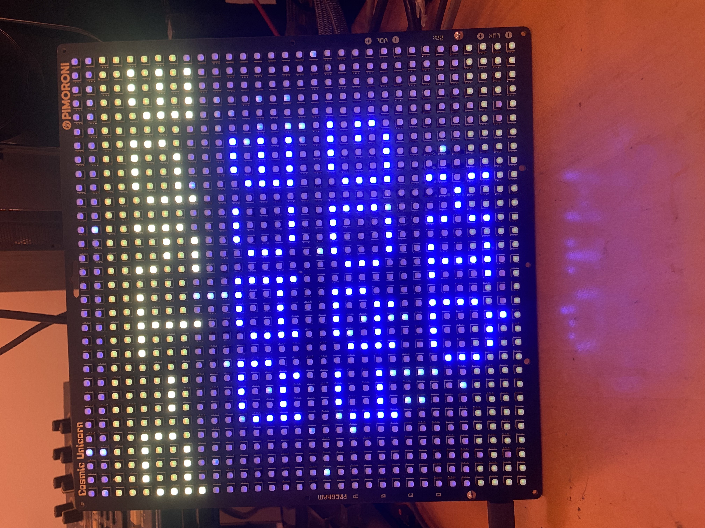
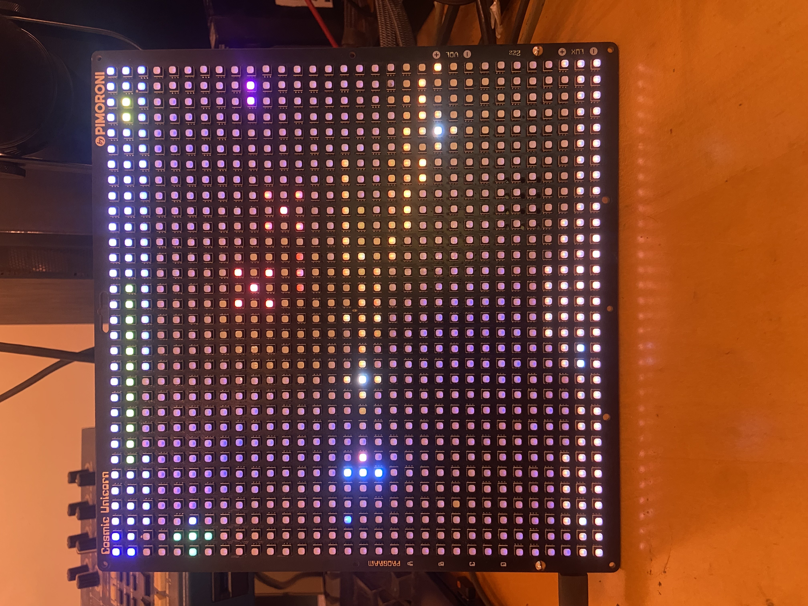
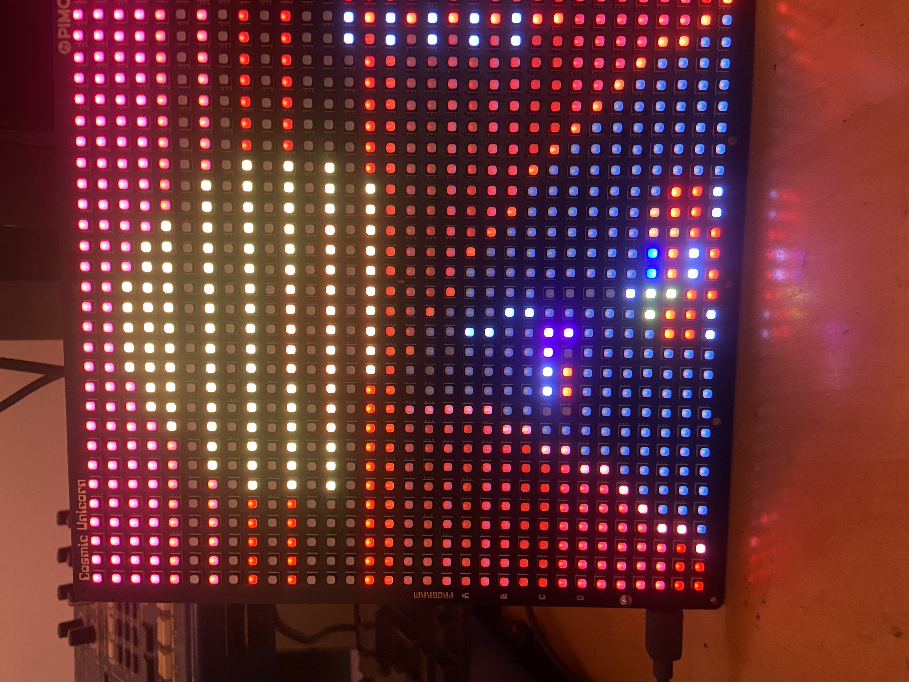
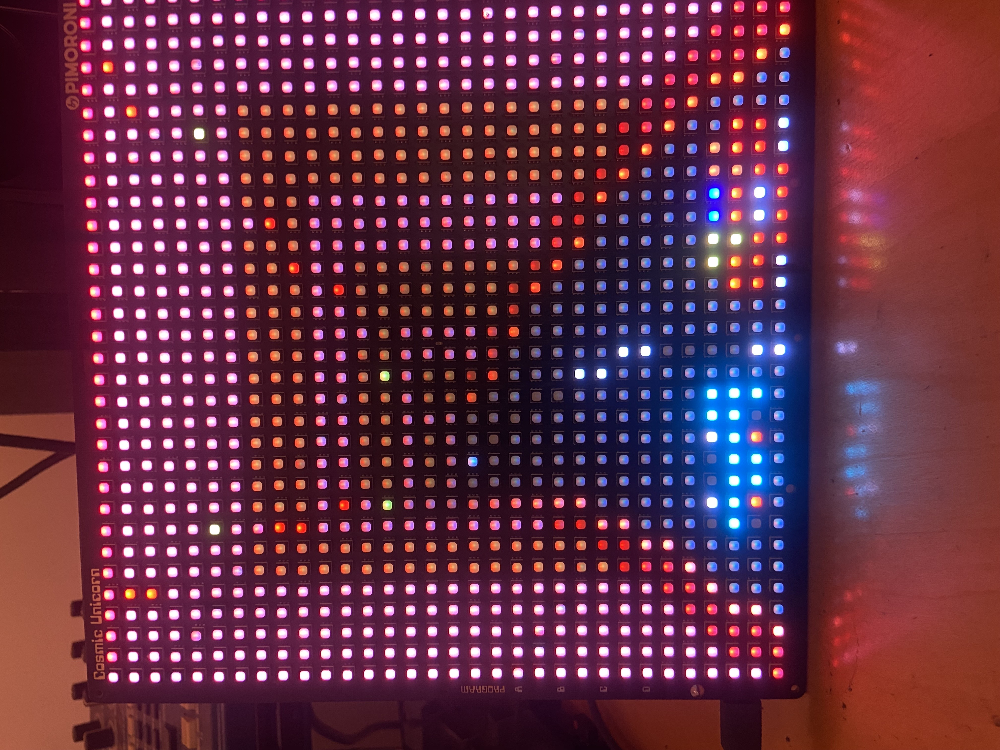
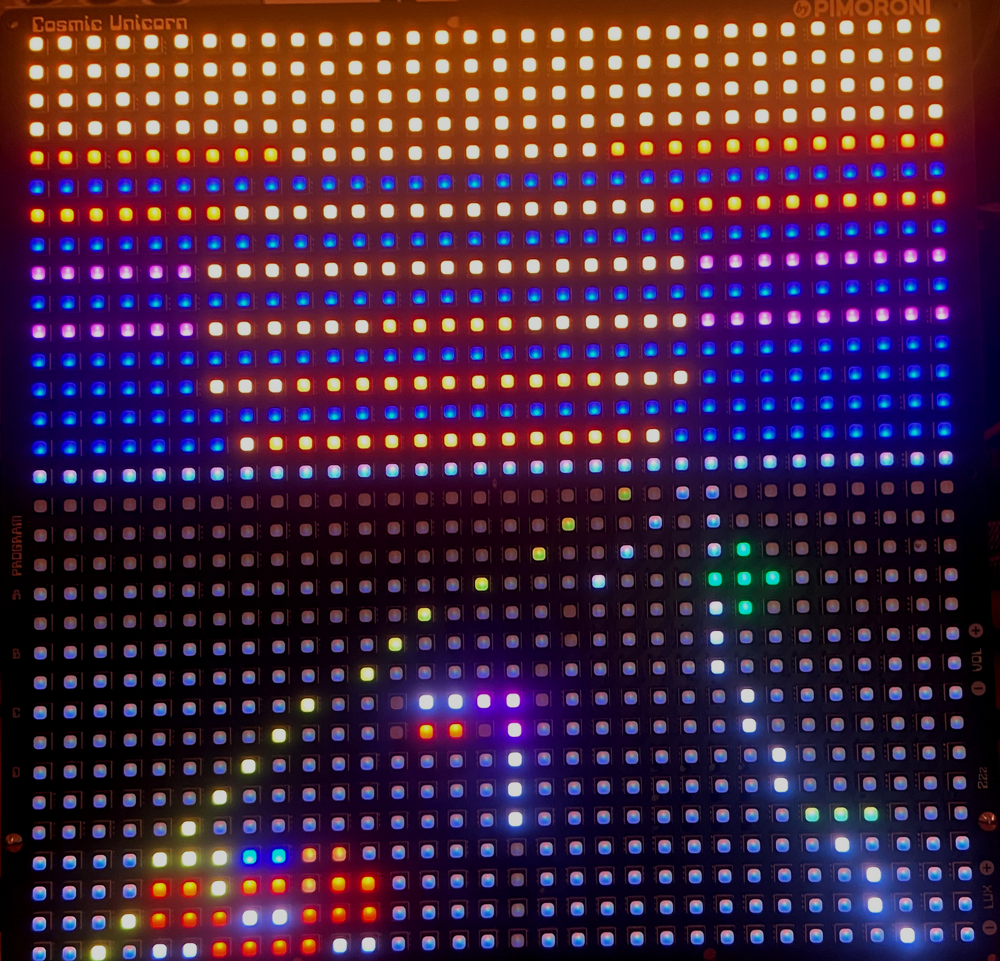
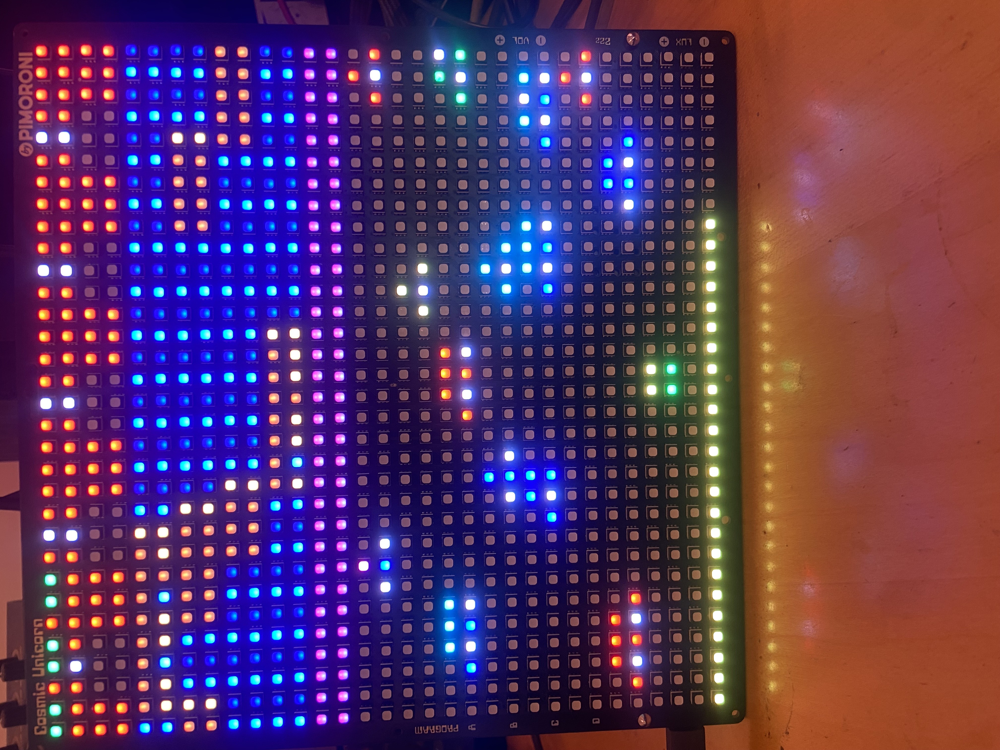
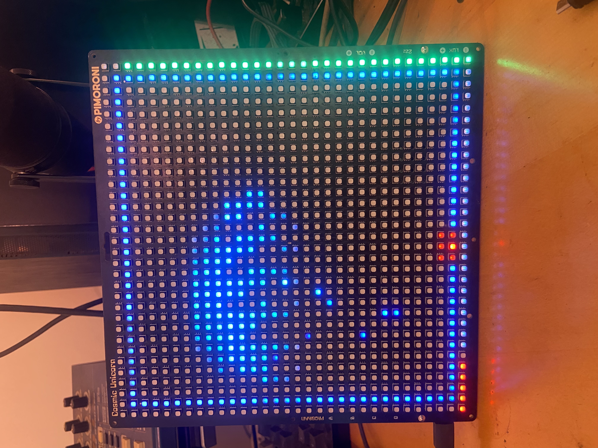
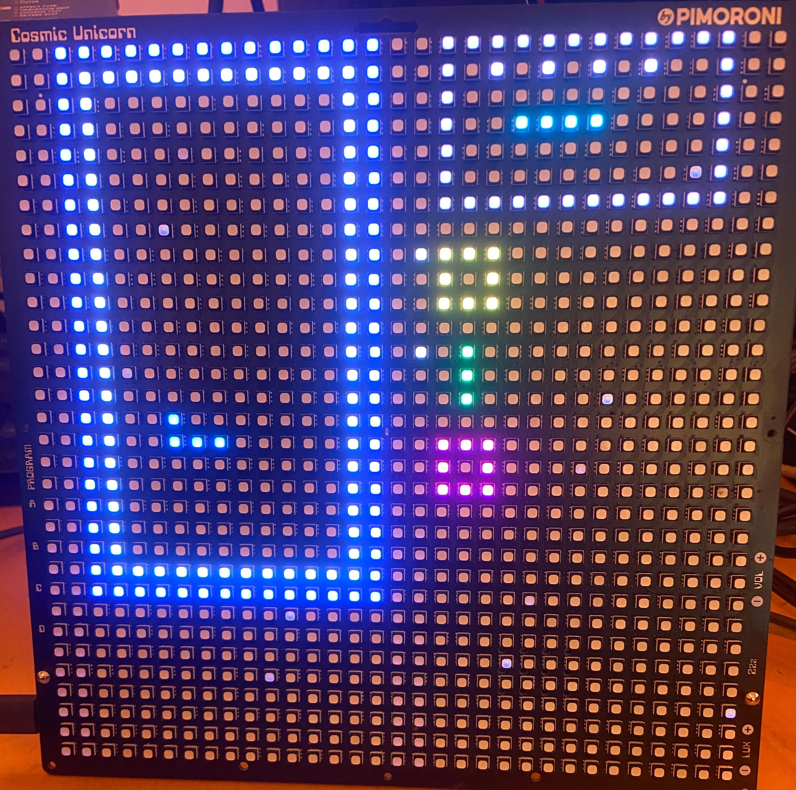

# Cosmic Launcher - Pimoroni Cosmic Unicorn Games Collection

A collection of retro-inspired games and demos for the Pimoroni Cosmic Unicorn 32×32 RGB LED matrix display.

## 🎮 Games & Demos

- **SPOOK** - A spooky Halloween-themed animation
- **P-TYPE** - R-Type inspired side-scrolling space shooter
- **RACE** - OutRun-style arcade racing with multiple themes
- **FROG** - Classic Frogger gameplay adapted for LED matrix
- **QIX** - Territory control puzzle game
- **BLOCKS** - Tetris-style block puzzle game
- **PRETTY** - Colorful visual effects and animations

## 📸 Screenshots

*Main launcher menu interface*


*P-TYPE - R-Type inspired space shooter*


*RACE - OutRun-inspired racing*


*RACE - Racing in a tunnel*


*RACE - Racing in the dark*


*FROG - Cosmic Frogger gameplay*


*QIX - Territory control game*


*BLOCKS - Tetris-style puzzle game*


## 🚀 Quick Start

1. **Download** the latest release: [`cosmic_launcher.uf2`](https://github.com/mrkwllmsn/cosmic_laucher/blob/main/build/cosmic_launcher.uf2)
2. **Hold the BOOTSEL button** on your Pico while connecting it via USB
3. **Drag and drop** the `.uf2` file to the RPI-RP2 drive that appears
4. The Pico will automatically reboot and display the launcher menu

## 🎯 Controls

- **Navigation**: Use A/B/C buttons to navigate the launcher menu
- **Exit to Menu**: Hold **D button** during any game/animation to return to launcher
- **Game Controls**: Each game uses the Cosmic Unicorn's buttons (A, B, C, D, Volume, Brightness)

## 🛠 Development

### Using picotool (Recommended for Development)
```bash
sudo /usr/local/bin/picotool load './build/cosmic_launcher.uf2' -f
```

### Building from Source

**Prerequisites:**
- Pico SDK properly configured
- Pimoroni Pico libraries installed
- CMake 3.12 or higher

**Build Steps:**
1. Clone this repository
2. Initialize git submodules: `git submodule update --init`
3. Create build directory: `mkdir build && cd build`
4. Configure: `cmake .. -DPICO_BOARD=pico_w`
5. Build: `make cosmic_launcher`

The compiled `.uf2` file will be available in the `build/` directory.

## ⚡ Features

- **Seamless Navigation**: Easy-to-use launcher interface
- **Multiple Game Modes**: Each game supports both demo and interactive modes
- **Optimized Performance**: Smooth 60fps gameplay on 32×32 LED matrix
- **Retro Aesthetics**: Classic arcade-inspired visuals and gameplay

## 🤝 Contributing

Feel free to submit issues, feature requests, or pull requests to improve the games collection!

## 📝 License

This project builds upon the Pimoroni Pico libraries. Please refer to individual source files for specific licensing information. 

